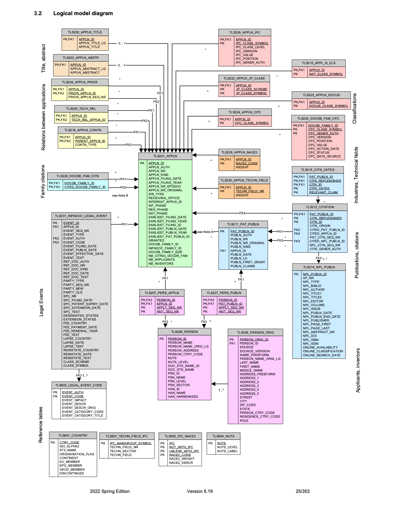

## Introduction

These scripts are based on those developed at altay-oz/load_patstat. 

The bulk downloads provided by EPO are served as batches of zip files. This
script assumes you have already downloaded and extracted these zip files, and
have a directory containing all the CSV files (the script will ask for this
directory - `CSV_FILES_DIR` - when run).

The script will also prompt for the password for the `patstat` postgresql user.
By default, a `patstat` user and database is assumed, and data is loaded into
the `public` schema. The script assumes that the postgresql database is running
on localhost.

## HOWTO

1. Run the `insert_data_to_patstat.sh` shell script. Enter the values as
   prompted. The script will create the schema and load the data from the CSV
   files, and then create rudimentary indexes. The script may run for a few
   hours.
2. Run the `count_rows_in_patstat` script. This script will count the rows in
   each patstat table. Compare those with the values provided in the EPO dump,
   under the `TestScripts` directory to verify that the database is complete.

## Reference

The ERD for this database structure matches that given in the EPO data
catalogue, included here for reference:

